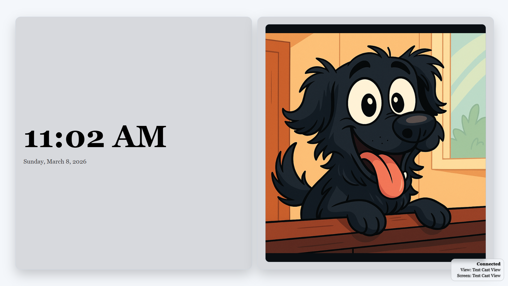
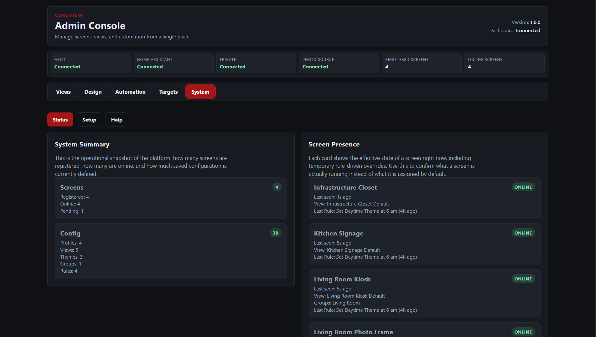
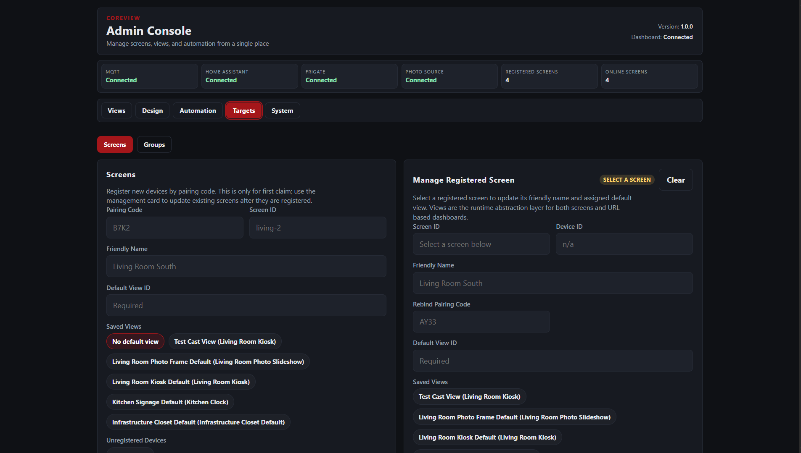
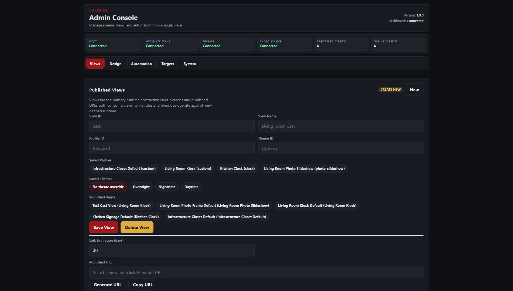

# CoreView

Self hosted control plane for automation driven smart displays and dashboards.

CoreView was built using a human directed engineering workflow with AI assisted development tools.

---

## Development Transparency

CoreView was developed with the assistance of modern AI tools.

The project architecture, implementation, documentation, and testing were created through a collaborative workflow between a human operator and AI systems used as development assistants.

All design decisions, system behavior, and security boundaries were intentionally reviewed and directed by the project maintainer. AI tools were used to accelerate implementation, explore architecture options, and assist with code generation and documentation.

This repository represents a fully functional project produced through human directed engineering with AI assisted development.

The goal of including this note is transparency and to demonstrate what modern AI assisted software development can produce when used as a collaborative tool rather than an autonomous system.

---

## Screenshots









---

## Example Use Cases

CoreView can power many types of display environments.

- Home automation dashboards
- Security event displays
- Digital signage
- Status boards for infrastructure or services
- Family information boards
- Office displays and announcements

Example scenarios include:

A Frigate camera detection triggers an alert banner on hallway displays.

A Home Assistant state change displays a notification across multiple screens.

An Immich slideshow rotates photos across living room displays.

An MQTT event updates a dashboard tile in real time.

---

## Core Architecture

CoreView separates control from presentation.

Operators manage configuration through the admin interface. Screen clients connect to the runtime and render assigned Views in real time.

System flow:

```text
Operator
  -> Admin UI
  -> CoreView Control Plane
  -> WebSocket Runtime Channel
  -> Screen Clients
```

Screen clients can run on any device capable of opening a modern web browser.

Examples include:

- Fire TV browsers
- Kiosk browsers
- Raspberry Pi displays
- Wall mounted tablets
- HDMI displays running a browser

The client only needs a browser and a network connection to the CoreView server.

---

## Core Data Model

CoreView uses a View based runtime abstraction to prevent configuration drift and ambiguous display state.

Theme
Defines visual styling.

Profile
Defines layout structure and widget composition.

View
Binds a Theme and Profile together into a runtime display object.

Screen
Is assigned exactly one View.

Screens never bind directly to Profiles or Themes. This guarantees a single source of truth for display configuration.

---

## Information Architecture

The admin interface is organized into several core surfaces.

`/system`
Platform status, diagnostics, and setup.

`/views`
View creation and assignment.

`/design`
Profiles, widgets, and themes.

`/automation`
Rules, banners, tickers, and manual overrides.

`/targets`
Screens and screen groups.

Operators should bookmark:

```text
http://host:3210/system
```

Screen clients should load:

```text
http://host:3210/
```

The root path automatically resolves to the display runtime.

---

## Integrations

CoreView integrates with common automation and media platforms.

Home Assistant
Live entity state and automation data.

MQTT
Messaging and event distribution.

Frigate
Object detection events and camera triggers.

Immich
Photo slideshow and media displays.

These integrations allow automation events to influence what appears on screens.

---

## Automation and Rules

CoreView includes a rule engine capable of triggering display changes based on external events.

Supported triggers include:

Frigate detection events
Home Assistant state changes
Scheduled daily triggers

Rules can perform temporary override actions such as:

Overlay banners
Theme changes
Profile swaps
Ticker activation

This allows displays to dynamically react to events happening in the environment.

---

## Installation

The recommended installation method is Docker.

Clone the repository.

```bash
git clone https://github.com/<repo>/coreview
cd coreview
```

Create an environment file.

```bash
cp .env.example .env
```

Start the platform.

```bash
docker compose up -d --build
```

CoreView listens on port `3210` by default.

---

## First Run Setup

Set the bootstrap token in the environment.

```text
COREVIEW_BOOTSTRAP_TOKEN=your_secure_token
```

After starting the server:

1. Open `/system`
2. Complete the onboarding process
3. Create a Theme
4. Create a Profile
5. Create a View
6. Register a screen
7. Assign the View to that screen

Once a screen connects it will begin rendering its assigned View.

---

## Screen Registration

CoreView uses a device registration process to enroll new screens.

When a display connects to the CoreView server for the first time it does not immediately gain access to the runtime. Instead it enters a registration state.

The server generates a short pairing code that must be approved by an operator.

The registration flow works as follows.

1. A new screen opens the CoreView root URL.
2. The screen receives a temporary pairing code.
3. The operator reviews the pending device in the admin interface.
4. The operator approves the device and assigns a name.
5. The server generates a unique device key for the screen.
6. The screen reconnects and authenticates using that device key.

After registration the screen becomes a trusted runtime client.

Each screen has its own device key and identity stored in the CoreView database.

### Why Registration Exists

The registration process prevents unauthorized devices from connecting to the display runtime.

Without this step any device on the network could attempt to connect to the WebSocket runtime and render Views.

Registration ensures that:

- Only approved devices become screens
- Each screen has a unique identity
- Device authentication occurs automatically on reconnect

### Managing Screens

Registered screens appear under the `Screens` management page.

Operators can:

- Rename screens
- Assign Views
- Group screens together
- Remove or unregister a device

If a screen is removed it will return to the registration state the next time it connects.

---

## Published Views

CoreView allows Views to be published as secure URLs. A published View can be opened directly in a browser without registering the device as a managed screen.

This feature enables flexible display scenarios such as temporary displays, browser bookmarks, and casting to other devices.

### How Published Views Work

When a View is published, CoreView generates a signed URL containing a short lived access token.

Example format:

```text
http://host:3210/v/<view>?vt=<signed_token>
```

The signed token authorizes the client to render the View without completing the screen registration process.

Published Views respect an expiration policy that can be configured when generating the link.

### Typical Uses

Published Views are useful when a device does not need to be permanently registered as a screen.

Common examples include:

- Opening a dashboard in a browser tab
- Casting a View to a Google Cast device
- Displaying a View on a temporary monitor
- Sharing a display with another device on the network
- Embedding a View in a kiosk browser

### Generating a Published View

To generate a published View URL:

Open the View editor

Select the View you want to publish

Set the desired link expiration

Click Generate URL

Copy the generated link

The resulting URL can be opened on any device capable of loading a web page.

### Security Model

Published View URLs contain signed tokens generated by the server.

These tokens include an expiration window and are validated using timing safe comparison.

If a token expires, the View will no longer load and a new URL must be generated.

This allows Views to be shared temporarily without permanently registering the device.

Published Views are intended for trusted networks or environments behind a reverse proxy.

---

## Data Directory

All persistent state is stored in the local data directory.

```text
./data/
```

This directory contains:

SQLite database
Encrypted integration secrets
Backup archives
Runtime state

Do not delete this directory during upgrades.

Back up this directory before major upgrades.

---

## Upgrading

Before upgrading:

1. Stop the container
2. Back up the data directory
3. Pull the latest repository
4. Rebuild the container

```bash
docker compose down
git pull
docker compose up -d --build
```

Always review `CHANGELOG.md` before upgrading.

---

## Security Overview

CoreView is designed for controlled self hosted environments.

Security protections include:

- Device key authentication for screen clients
- HMAC signed webhook events
- Timing safe token validation
- Replay protection for webhook requests
- Strict security headers and Content Security Policy
- Secure cookies when served over HTTPS

Refer to `SECURITY.md` for full details.

---

## Deployment Guidance

CoreView is intended for:

Home lab environments
Internal dashboards
Smart office displays
LAN based automation systems

It is not designed as a public multi tenant SaaS platform.

If exposing CoreView outside a trusted LAN, it should be placed behind a reverse proxy with HTTPS.

Supported reverse proxy options include:

- Nginx
- Traefik
- Caddy
- Nginx Proxy Manager

---

## Contributing

Contributions, bug reports, and suggestions are welcome.

Please open an issue describing the problem or proposed change.

Pull requests should include clear descriptions and follow the existing project structure.

---

## License

CoreView is released under the MIT License.

See `LICENSE` for full details.
